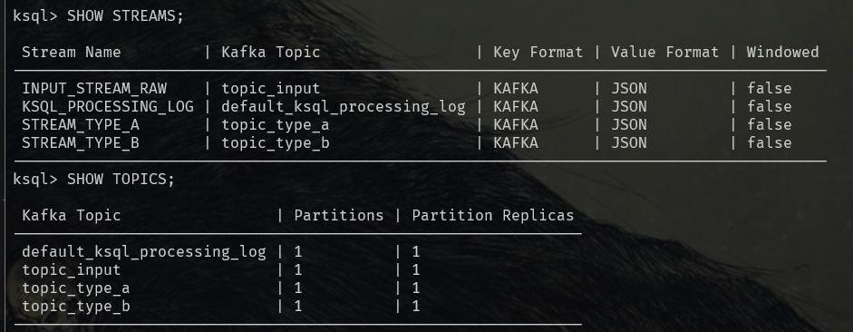
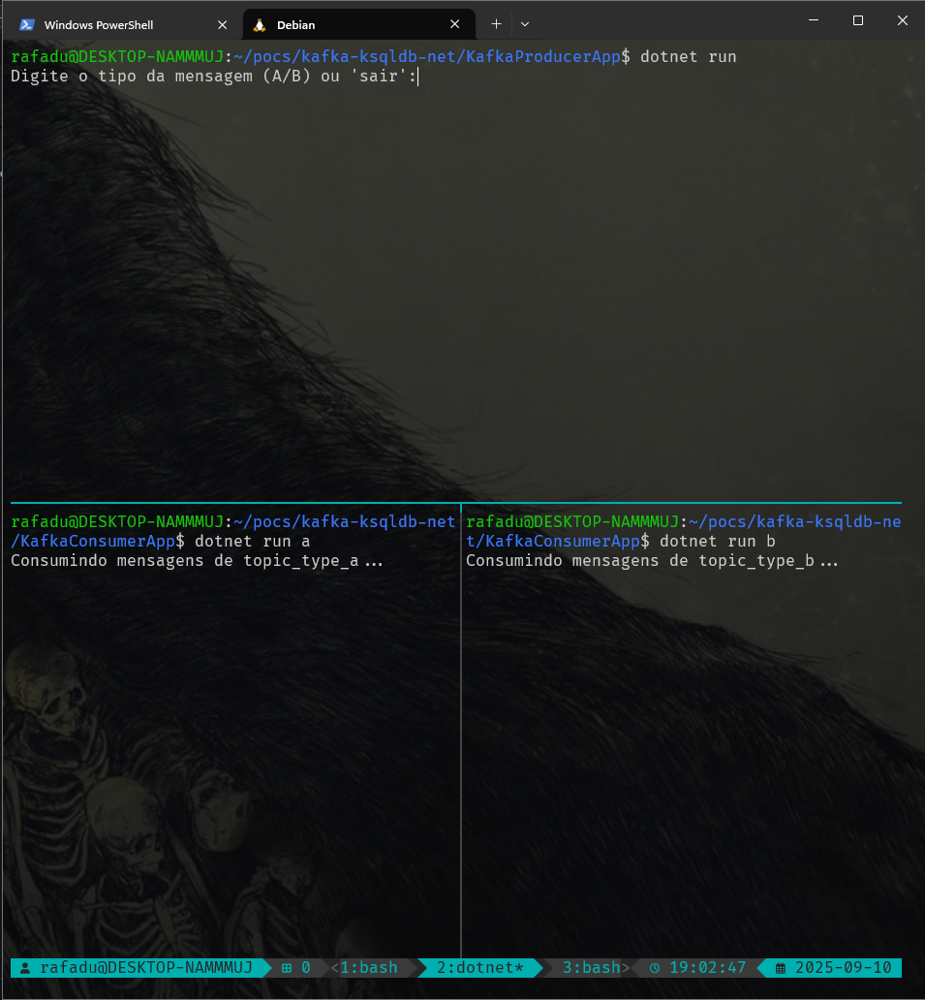
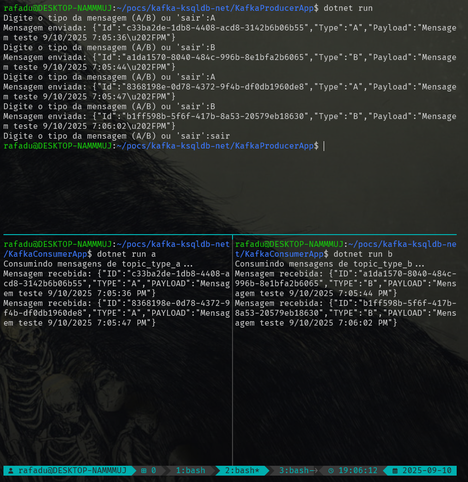

# Kafka ksqlDB PoC

Este projeto é uma PoC para validar a transmissão de mensagens entre diferentes tópicos Kafka a partir de um tópico central, utilizando o ksqlDB e o conceito de streams.

## Objetivo

Demonstrar como o ksqlDB pode ser utilizado para consumir mensagens de um tópico central e, a partir de regras definidas, encaminhá-las para diferentes tópicos de destino. Isso permite a criação de pipelines de dados dinâmicos e flexíveis, facilitando o processamento e roteamento de eventos em tempo real.

## Estrutura do Projeto

- **/kafka-compose**: Contém o docker-compose de configuração do Kafka, do ksqlDB e de um Client para execução de comandos e junto um arquivo SQL contendo os comandos a serem executados no Client para a criação dos Streams.
- **/KafkaConsumerApp**: Projeto de consumer de mensagens de tópicos do Kafka
- **/KafkaProducerApp**: O projeto responsável por produzir mensagens de diferentes tipos, mas para o mesmo tópico.

## Processo de Transmissão

1. **Criação do Tópico Central**  
    Um tópico Kafka é criado para receber todas as mensagens iniciais.

2. **Definição de Streams no ksqlDB**  
    Utilizando o ksqlDB, são criadas streams que consomem do tópico central. Cada stream pode aplicar filtros ou transformações conforme regras de negócio.

3. **Encaminhamento para Tópicos de Destino**  
    As streams podem ser configuradas para publicar mensagens em diferentes tópicos de destino, de acordo com o conteúdo ou tipo da mensagem.

4. **Validação**  
    Ao rodar 2 instâncias do projeto consumidor apontando para tópicos diferentes é possível acompanhar o consumo das mensagens através dos registros nos consoles

## Como Executar

1. Suba os serviços com Docker Compose:
    ```
    docker-compose up -d
    ```
    OBS: Pode ser necessário alterar as versões das imagens
2. Acesse o ksqlDB client:
    ```
    docker exec -it ksqldb-cli ksql http://ksqldb-server:8088
    ```
3. Rode os comandos do arquivo kafka-compose/ksqlDB-Criacao-Itens.sql
<br />
    OBS: Copie cada comando, cole no terminal e execute.
<br />
    Para confirmar a criação você pode rodar os seguintes comandos:
    ```
    SHOW STREAMS;
    ```
    ```
    SHOW TOPICS;
    ```
    

4. Configure 3 terminais, 1 para o producer, 2 para os consumers. Rode as aplicações via dotnet run. Para os consumers é importante passar como parâmetro a letra correspondente ao tópico que irão consumir. A imagem abaixo exemplifica



OBS: Estou usando tmux dentro do WSL para facilitar o gerenciamento dos terminais.

5. Na aplicação produtora (o terminal de cima), comece a preencher com ou A ou B (por ser uma poc a validação é mínima). Se tudo estiver correto, nos terminais de baixo começarão a aparecer logs das mensagens consumidas por eles. Perceba o comportamento nos terminais de baixo



Nesse exemplo, foram publicadas 4 mensagens, 2 do tipo A e 2 do tipo B. O consumidor da esquerda recebeu somente as 2 mensagens do tipo A e o consumidor da direita recebeu somente as 2 mensagens do tipo B


## Tecnologias Utilizadas

- Apache Kafka
- ksqlDB
- Docker / Docker Compose
- .NET 8

## Referências

- [ksqlDB Documentation](https://ksqldb.io/)
- [Apache Kafka Documentation](https://kafka.apache.org/documentation/)

---

Este projeto serve como base para estudos e validação de cenários envolvendo roteamento dinâmico de mensagens com Kafka e ksqlDB.